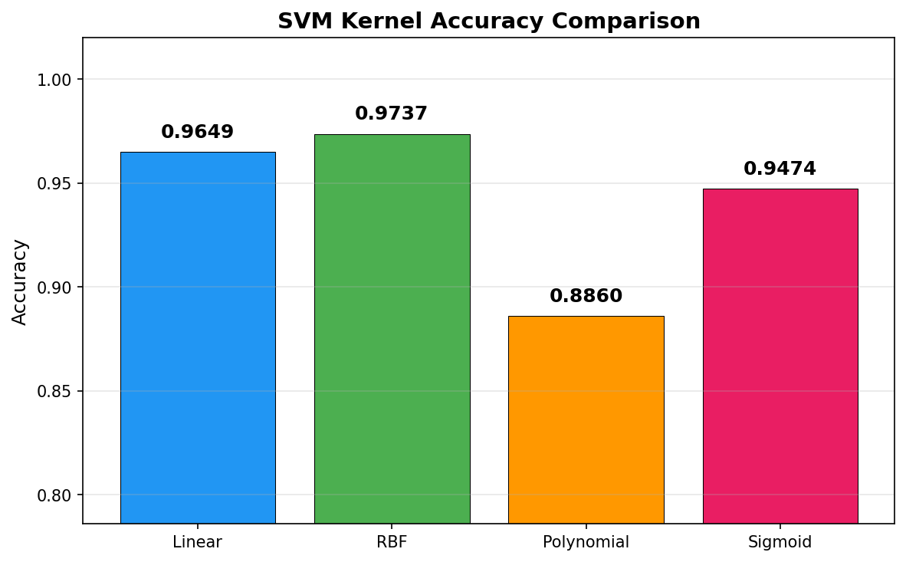
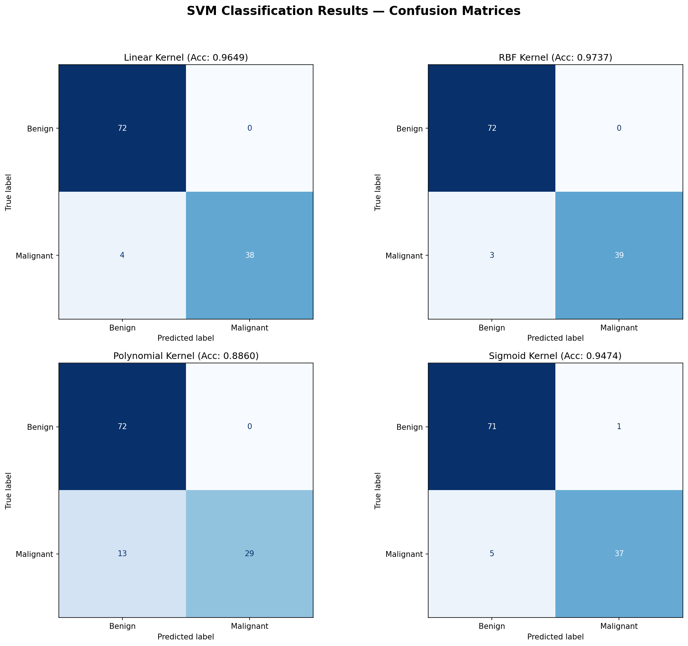
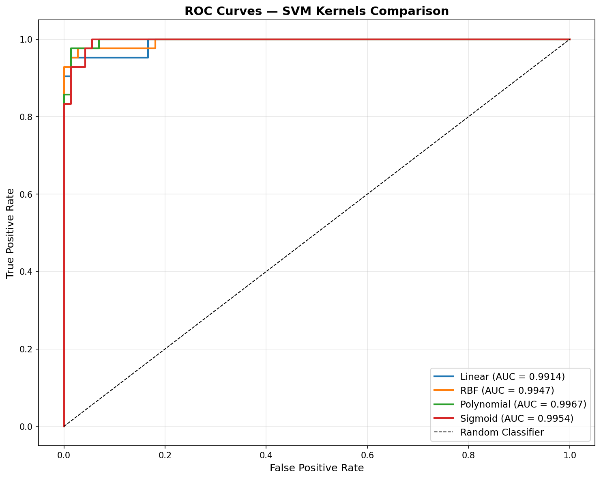
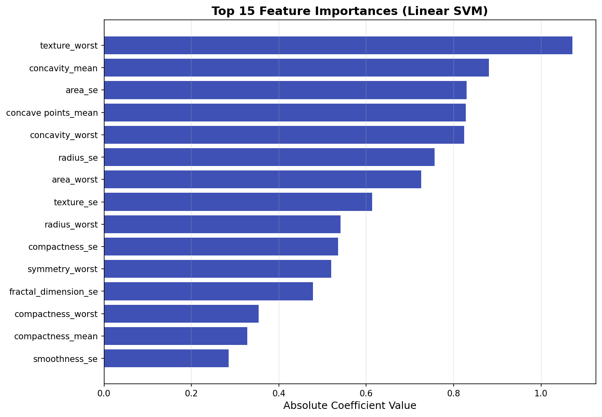

# SVM Classification on the Breast Cancer Dataset

This project is a simple, beginner-friendly example for understanding how **Support Vector Machines (SVMs)** work and how different **kernel tricks** affect classification performance.

The goal is not to build a production-grade model, but to explore:
- how SVM separates classes using margins,
- how feature scaling impacts SVM behavior,
- how linear, RBF, polynomial, and sigmoid kernels behave on the same dataset.

## Dataset

The project uses the Wisconsin Breast Cancer dataset stored in [data.csv](data.csv).

- Total samples: **569**
- Number of features: **30**
- Target classes:
  - `B` → Benign
  - `M` → Malignant

## Project Workflow

1. Load the dataset and inspect its structure.
2. Encode the target labels (`B` → `0`, `M` → `1`).
3. Split the data into training and testing sets using stratification.
4. Standardize the feature values.
5. Train SVM models using four different kernels:
   - Linear
   - RBF
   - Polynomial
   - Sigmoid
6. Compare performance using accuracy, classification reports, confusion matrices, and ROC curves.

## Model Results

The script evaluates all four kernels and prints the classification report for each model.

| Kernel | Accuracy |
|--------|----------:|
| Linear | 0.9649 |
| RBF | 0.9737 |
| Polynomial | 0.8860 |
| Sigmoid | 0.9474 |

### Best Performing Model

The **RBF kernel** gave the highest accuracy on the test set:

- **Best model:** RBF SVM
- **Test accuracy:** **0.9737**

This is a good example of how the RBF kernel can capture more complex decision boundaries than a simple linear separator.

## Output Visualizations

The following plots are generated by the script and saved in the [outputs](outputs) folder:

### Accuracy Comparison



### Confusion Matrices



### ROC Curves



### Feature Importance (Linear SVM)



## How to Run

```bash
python3 svm_classification.py
```

The script will:
- train all four SVM kernels,
- print evaluation metrics,
- save the charts into the [outputs](outputs) folder.

## Learning Purpose

This is a **basic educational project** meant to help understand:
- what SVMs do,
- why scaling features is important,
- how different kernels change the model behavior,
- how to interpret evaluation metrics and visualization outputs.

If you are learning machine learning, this project is a useful starting point for seeing how SVMs behave in practice.
